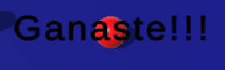

# Roll-A-Ball Customized

Este proyecto es una personalización del clásico juego Roll-A-Ball de Unity, donde el jugador controla una bola para recoger objetos y alcanzar un objetivo. Se han realizado varias personalizaciones y agregados, que se detallan a continuación.

## Cambios y características añadidas

### Creo nuevos obstáculos
He creado cuatro nuevos objetos en la plataforma, son 4 cilindros que están por el medio de la zona y a la hora de jugar agregan dificultad al juego ya que al intentar coger las monedas es probable que te entorpezcan, en este caso son objetos bastante simples, solo les he cambiado el color, he puesto la mitad blancos y la otra mitad negros.

## Creo 3 nuevas interacciones:
### Multiplicación de monedas (velocidad)

Se ha implementado una función para multiplicar la velocidad cada vez que el jugador recoge una moneda. Esto se logra a través del script `PlayerController`, donde he agregado una condición la cual actúa de tal manera que por cada moneda que obtienes tu velocidad se multiplicará x1.5.

### Multiplicación de monedas (monedas)
He establecido un multiplicador que en cuanto llegas a coger 3 monedas tu saldo se multiplica x2 y así constantemnete lo cual propicia que puedas almcanzar 20 monedas cuando por físicas solo hay 8. ESto se implementa en el mismo sitio que el otro multiplicador, el script `PlayerController`.

### Enemigo añadido

Se ha agregado un enemigo al juego, representado por un cilindro de color rosa, que persigue constantemente al jugador, este no parará de perseguirle hasta que consiga acabar el juego. El enemigo se controla mediante un script llamado `Enemigo Perseguir`, donde se implementa la lógica de seguimiento al jugador.

.gif>)

### Elevación de pared al recolectar monedas

Cuando el jugador recolecta un total de cinco monedas, se activa un script llamado `ControlMuro` que eleva la pared 'West Wall'. Esto se logra manipulando programáticamente la posición del objeto de la pared a través de la función `AumentarMonedasRecogidas()` en el script del controlador del jugador. Al elevarse esta el jugador podrá salir de la plataforma, si es así caerá al vacio, en próximas actualizaciones podría desbloquearle una nueva zona.

## Texto Victoria y puntuación:
El juego tiene un marcador que suma la puntuación que vas alcanzando según las monedas que cojas, cuando llegas a 20 monedas (el máximo que se puede conseguir) ganas y el juego te lo confirma con un mensaje de 'Ganaste!!' en el centro de la pantalla.

## Animator
Añado una animación al aparecer el texto de victoria lo cual hace que aparezca desde abajo y se mueva hacia el medio hasta quedarse ahí.

